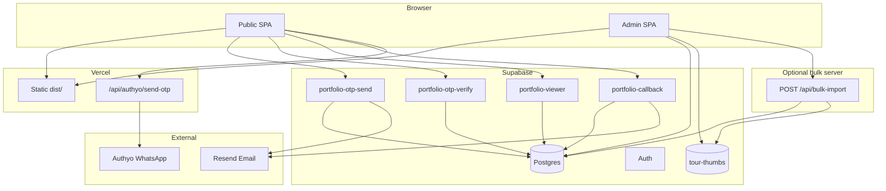

# NS Ventures Portfolio — Full Documentation

Marketing website and admin CMS for NS Ventures (real-estate visual production: property films, drone, and 360° virtual tours). The public site showcases portfolio work behind an email/WhatsApp OTP gate; admins manage tours, cities, and bulk imports via Supabase.

---

## Table of contents

1. [Overview](#1-overview)
2. [Architecture](#2-architecture)
3. [Tech stack](#3-tech-stack)
4. [Project structure](#4-project-structure)
5. [Routing](#5-routing)
6. [Public site — how it works](#6-public-site--how-it-works)
7. [Portfolio access & OTP flow](#7-portfolio-access--otp-flow)
8. [Admin panel](#8-admin-panel)
9. [Supabase backend](#9-supabase-backend)
10. [External services](#10-external-services)
11. [Environment variables](#11-environment-variables)
12. [Local development](#12-local-development)
13. [Deployment](#13-deployment)
14. [npm scripts reference](#14-npm-scripts-reference)
15. [Key source files](#15-key-source-files)
16. [Troubleshooting](#16-troubleshooting)
17. [Known gaps](#17-known-gaps)

---

## 1. Overview

### What the site does

| Area | Description |
|------|-------------|
| **Public marketing site** | Hero video, portfolio grid (videos + VR tours), smooth scroll, animations |
| **Portfolio gate** | Visitors verify via email + WhatsApp OTP before viewing media links |
| **Callback form** | Navbar “Get a callback” → email notification + database lead |
| **Admin CMS** | Login, dashboard, tour CRUD, cities, bulk CSV/Excel import |

### What is protected

- **Tour/video links** are never returned in the public listing API. They are only served by a Supabase edge function after a valid 30-day session JWT.
- **Admin** requires Supabase Auth + a row in `admin_users` (allowlist).

### Hosting split

| Component | Where it runs |
|-----------|---------------|
| React frontend | Vercel (static `dist/`) |
| WhatsApp OTP relay | Vercel serverless (`/api/authyo/send-otp`) |
| Database, auth, storage, edge functions | Supabase |
| Bulk import (optional) | Separate Docker server (Railway / Render) |

---

## 2. Architecture



### Production WhatsApp OTP path

```
User → portfolio-otp-send (Supabase)
     → email via Resend
     → returns signed whatsappDispatchToken
User browser → POST /api/authyo/send-otp (Vercel)
             → verifies token with OTP_HASH_SECRET
             → Authyo API → WhatsApp message (same 6-digit code)
```

WhatsApp is **not** sent directly from the browser or from Supabase edge to Authyo. A short-lived HMAC token bridges Supabase and the Vercel relay.

---

## 3. Tech stack

| Layer | Technology |
|-------|------------|
| Frontend | React 19, TypeScript, Vite 8 |
| Routing | React Router 7 |
| Styling | Tailwind CSS 4 |
| Animation | GSAP, Framer Motion, Lenis |
| Backend | Supabase (Postgres, Auth, Storage, Edge Functions) |
| Email | Resend |
| WhatsApp OTP | Authyo (via Vercel relay) |
| Hosting | Vercel |
| Bulk import | Node HTTP server + Playwright (Docker) |
| Analytics | `@vercel/analytics` |

---

## 4. Project structure

```
nsvportfolio/
├── api/                    # Vercel serverless routes
│   └── authyo/send-otp.mjs # WhatsApp relay (production)
├── docs/
│   └── DOCUMENTATION.md    # This file
├── server/                 # Optional bulk-import + dev relay
│   ├── bulk-import.mjs
│   ├── Dockerfile
│   └── lib/
├── scripts/                # CLI utilities (import, delete, backfill)
├── supabase/
│   ├── migrations/         # 001–015 SQL migrations
│   ├── functions/          # Edge functions + _shared helpers
│   └── README.md           # Supabase setup quick-start
├── src/
│   ├── Root.tsx            # Top-level router
│   ├── PublicApp.tsx       # Public marketing site
│   ├── admin/              # Admin SPA (/admin/*)
│   ├── api/                # Public API clients
│   ├── components/         # UI, layout, sections
│   ├── context/            # PortfolioAccessContext
│   ├── hooks/
│   ├── lib/                # supabase, portfolioAccess, etc.
│   └── types/
├── .env.example            # Env var reference
├── vercel.json             # SPA rewrites
└── vite.config.ts          # Dev proxy → :3001
```

---

## 5. Routing

### Entry point: `src/Root.tsx`

| Path | App | Notes |
|------|-----|-------|
| `/admin/*` | `AdminApp` (lazy) | Requires `VITE_SUPABASE_*` |
| `/*` | `PublicApp` | Single-page scroll site |

### Public site

No path-based routes. Portfolio filters use URL hash:

- `#videos` — property marketing videos
- `#virtual-tours` — 360° VR tours

### Admin routes (`src/admin/AdminApp.tsx`)

| URL | Page |
|-----|------|
| `/admin/login` | Login |
| `/admin` | Dashboard |
| `/admin/tours` | Portfolio list |
| `/admin/tours/new` | Create tour |
| `/admin/tours/:id/edit` | Edit tour |
| `/admin/cities` | Cities CRUD |
| `/admin/bulk-upload` | Bulk import |

**Auth:** `AdminGuard` checks Supabase session + `admin_users` allowlist. Non-admins are signed out immediately.

### Vercel API (not React routes)

| Endpoint | Handler |
|----------|---------|
| `POST /api/authyo/send-otp` | `api/authyo/send-otp.mjs` |
| `POST /api/bulk-import` | Only when using separate import server or dev proxy |

`vercel.json` rewrites all non-`/api/*` paths to `index.html` for SPA routing.

---

## 6. Public site — how it works

### Page composition (`PublicApp.tsx`)

1. **Navbar** — logo, nav, “Get a callback” button
2. **Hero** — full-screen video (`public/hero.mp4`), tabs for Videos / VR
3. **Portfolio** — infinite-scroll grid, filters by state and media type
4. **Footer** + **FloatingActions** (WhatsApp, back-to-top)
5. **PortfolioAccessGateModal** — OTP verification (via context)
6. **PortfolioCallbackModal** — callback request form

Wrapped in `PortfolioAccessProvider` for gate + viewer state.

### Portfolio listing

```
usePortfolio hook
  → fetchPortfolioPage() [src/api/portfolio.ts]
    → supabase.rpc('get_portfolio_page', { p_page, p_page_size, p_city, p_state, p_media_type, p_category })
```

- Page size: **15** items
- Returns: items (id, name, thumbnail, labels — **no link**), counts, pagination
- Videos sorted **newest first** by `video_published_at`
- VR tours sorted by `sort_order`
- Thumbnail URLs: `{SUPABASE_URL}/storage/v1/object/public/tour-thumbs/{path}`

If Supabase is not configured, returns an empty stub with static city/state counts from `metroCities.ts`.

### Portfolio viewer (protected)

When a user clicks a portfolio card:

1. `PortfolioAccessContext.openPortfolioItem(entry)` runs
2. If not verified → show OTP gate (stores pending entry)
3. If verified → open `PortfolioVideoModal`
4. Modal calls `fetchPortfolioViewer(itemId)` with Bearer JWT from `localStorage`
5. Edge function `portfolio-viewer` returns `{ link, mediaType }`
6. Player renders YouTube embed, native video, or VR iframe

Links were removed from the public RPC in migration **008**. Direct table access for anon users was dropped. Only the edge function serves links (migration **011**).

---

## 7. Portfolio access & OTP flow

### Gate timing (`src/lib/portfolioAccess.ts`)

| Setting | Value | Meaning |
|---------|-------|---------|
| `PORTFOLIO_ACCESS_VALIDATION_ENABLED` | `true` | OTP required |
| `PORTFOLIO_ACCESS_TIMER_MS` | `18000` (18s) | Auto-show gate after page load |
| `PORTFOLIO_ACCESS_TTL_MS` | 30 days | Session length (matches server JWT) |
| `localStorage` key | `nsv-portfolio-access-v3` | Stored session |

Clicking a portfolio item before verification opens the gate immediately.

### Step 1 — Send OTP

**UI:** `PortfolioAccessGateModal` → `sendPortfolioEmailOtp()` in `src/api/portfolioOtp.ts`

**Supabase edge `portfolio-otp-send`:**

1. Validate name, email, Indian mobile (+91)
2. Rate limit: 5 sends/hour per email and phone; 60s resend cooldown
3. Delete any unverified challenge for that email
4. Generate 6-digit OTP, hash with `OTP_HASH_SECRET`
5. Insert row in `portfolio_otp_challenges`
6. Send email via **Resend**
7. Create `whatsappDispatchToken` (HMAC, 5 min TTL)
8. Return masked email/phone + dispatch token

**Browser → Vercel relay:**

1. `POST /api/authyo/send-otp` with `{ token, origin }`
2. Relay verifies token with `OTP_HASH_SECRET` (must match Supabase)
3. Calls Authyo API with same OTP
4. User receives WhatsApp message

Default relay URL: `/api/authyo/send-otp` (same domain). Override with `VITE_AUTHYO_RELAY_URL`.

### Step 2 — Verify OTP

**UI:** user enters 6-digit code → `verifyPortfolioEmailOtp()`

**Supabase edge `portfolio-otp-verify`:**

1. Load latest unverified challenge for email
2. Check expiry, max 5 attempts
3. Compare OTP hash
4. Mark challenge `verified_at`
5. Insert lead into `inquiries` (`project_type: "Portfolio viewer"`)
6. Issue **30-day JWT** (`ACCESS_TOKEN_SECRET` or `OTP_HASH_SECRET`)
7. Return profile + `accessToken` + `expiresAt`

**Browser:** `savePortfolioAccess()` → `localStorage` → open pending portfolio item.

### Session usage

`fetchPortfolioViewerFromSupabase()` sends:

```
Authorization: Bearer {accessToken}
```

to `portfolio-viewer`. Expired/invalid tokens clear storage and show gate again.

### Callback flow (separate from OTP)

**Navbar → PortfolioCallbackModal → `submitPortfolioCallback()`**

Edge function `portfolio-callback`:

1. Validate name, email, phone
2. Send notification email via Resend → `CALLBACK_NOTIFY_EMAIL`
3. Insert row in `inquiries` (`project_type: "Callback request"`)

---

## 8. Admin panel

### Authentication

1. Supabase Auth email/password at `/admin/login`
2. `useAdminAuth` loads session, checks `admin_users` for `user_id`
3. Non-allowlisted users are signed out with error

**Setup (once per admin):**

1. Create user in Supabase Dashboard → Authentication → Users
2. SQL: `insert into admin_users (user_id, email) values (...);`

### Dashboard (`/admin`)

Stats: total tours, videos, VR tours, published count.

### Tours (`/admin/tours`, `/admin/tours/new`, `/admin/tours/:id/edit`)

- Search, filter by state / media type / publish status
- Drag-and-drop reorder (`reorderTours`)
- Fields: id, name, link, state, builder, project, city label, media type, category, publish flag, thumbnail
- Thumbnails upload to Supabase Storage bucket `tour-thumbs`
- Duplicate tour (copies thumbnail), delete (cleans up storage)
- Form drafts saved in `localStorage` (`tourFormDraft.ts`)

All CRUD via `src/admin/api/adminPortfolio.ts` (direct Supabase client with admin session).

### Cities (`/admin/cities`)

- List cities with tour counts
- Add city (name + state), update state, toggle `is_active`
- Merge cities (move tours, delete source)
- Delete city

### Bulk upload (`/admin/bulk-upload`)

Two tabs: **Virtual tours** | **YouTube videos**

1. Upload Excel/CSV — parsed client-side (`parseBulkSheet.ts` + `xlsx`)
2. Grouped by state, uploaded in batches
3. `POST /api/bulk-import` with admin Bearer token
4. Server streams **SSE** progress: `start`, `item`, `complete`, `warn`, `fatal`

**Per row (server `server/bulk-import.mjs`):**

- Skip or update if link already exists
- Thumbnail: YouTube CDN (videos) or Playwright screenshot (VR)
- Optional YouTube publish date (`YOUTUBE_API_KEY`)
- Insert/update `portfolio_items` via service role

**Requires:** separate import server in production (`VITE_BULK_IMPORT_API_URL`). Local dev uses `npm run dev:all` (Vite proxies to `:3001`).

---

## 9. Supabase backend

### Tables

| Table | Purpose |
|-------|---------|
| `cities` | Metro cities: name, state, sort_order, is_active |
| `portfolio_items` | Tours/videos: id, name, link, thumbnail_path, media_type, labels, category, video_published_at, etc. |
| `inquiries` | Leads: portfolio access, callbacks |
| `admin_users` | Admin allowlist (user_id → auth.users) |
| `portfolio_otp_challenges` | OTP state (service role only — no public RLS) |

### RPC: `get_portfolio_page`

Public listing function (security definer). Parameters:

- `p_page`, `p_page_size`
- `p_city`, `p_state`, `p_media_type`, `p_category` (optional filters)

Returns items **without** `link`, plus facet counts and pagination.

### Edge functions

| Function | JWT verify | Role |
|----------|------------|------|
| `portfolio-otp-send` | Disabled | Create OTP, email, dispatch token |
| `portfolio-otp-verify` | Disabled | Verify OTP, JWT, inquiry insert |
| `portfolio-viewer` | Bearer in request | Return link for published item |
| `portfolio-callback` | Disabled | Callback email + inquiry |

Deploy with JWT verification **disabled** for public functions (site has no Supabase login for visitors).

```bash
npx supabase link --project-ref YOUR_REF
npx supabase functions deploy portfolio-otp-send
npx supabase functions deploy portfolio-otp-verify
npx supabase functions deploy portfolio-viewer
npx supabase functions deploy portfolio-callback
```

Shared code lives in `supabase/functions/_shared/` (inline when pasting into Dashboard manually).

### Storage

- Bucket: **`tour-thumbs`** (public read)
- Admin upload via authenticated session + `is_admin()` RLS
- Public URL pattern: `{SUPABASE_URL}/storage/v1/object/public/tour-thumbs/{filename}`

### RLS summary

| Table | Anonymous | Admin |
|-------|-----------|-------|
| `cities` | SELECT active | Full CRUD |
| `portfolio_items` | No direct SELECT | Full CRUD |
| `inquiries` | INSERT | SELECT |
| `admin_users` | SELECT own row | Full CRUD |
| `portfolio_otp_challenges` | No access | Service role only |

Public portfolio data flows through `get_portfolio_page` RPC, not direct table queries.

### Migrations (001–015)

Run in order in Supabase SQL Editor:

| # | Summary |
|---|---------|
| 001 | Core schema, RLS, cities seed, RPC, storage bucket |
| 002 | `category` column |
| 003 | Category filter in RPC |
| 004 | Category counts per media type |
| 005 | `state` on cities |
| 006 | State counts logic |
| 007 | Item labels: state, builder, project, city_label |
| 008 | **Hide links** from public RPC |
| 009 | `portfolio_otp_challenges` |
| 010 | Email index on OTP |
| 011 | Revoke public `get_portfolio_viewer`; edge-only links |
| 012 | OTP delivery metadata |
| 013 | `video_published_at` |
| 014 | Videos newest-first sort |
| 015 | Video sort with state filter |

---

## 10. External services

### Resend (email)

- **Where:** Supabase edge `_shared/portfolio-otp.ts`
- **Secrets:** `RESEND_API_KEY`, `RESEND_FROM_EMAIL`, optional `RESEND_DEV_MODE`
- **Sends:** OTP emails, callback notifications to `CALLBACK_NOTIFY_EMAIL`

### Authyo (WhatsApp)

- **Where:** Vercel `api/authyo/send-otp.mjs` (production) or `server/bulk-import.mjs` (local)
- **Secrets on Vercel:** `AUTHYO_CLIENT_ID`, `AUTHYO_CLIENT_SECRET`, `AUTHYO_AUTHORIZED_ENDPOINT`
- **Dashboard:** Authorized endpoint must match site URL exactly (no trailing slash)

### Vercel

- Build: `npm run build` → output `dist/`
- SPA rewrite in `vercel.json`
- Serverless WhatsApp relay at `/api/authyo/send-otp`
- `VITE_*` vars baked in at build time; relay secrets at runtime

### Optional bulk server

- Docker image: `server/Dockerfile` (Playwright Chromium)
- Endpoints: health, bulk-import, authyo relay
- Env: `SUPABASE_URL`, `SUPABASE_ANON_KEY`, `SUPABASE_SERVICE_ROLE_KEY`

---

## 11. Environment variables

See `.env.example` for the full list. Summary by location:

### Vercel (frontend build)

| Variable | Required | Notes |
|----------|----------|-------|
| `VITE_SUPABASE_URL` | Yes | Public |
| `VITE_SUPABASE_ANON_KEY` | Yes | Public |
| `VITE_BULK_IMPORT_API_URL` | No | Remote bulk server URL |
| `VITE_AUTHYO_RELAY_URL` | No | Default: same-origin `/api/authyo/send-otp` |

### Vercel (serverless relay runtime)

| Variable | Required | Notes |
|----------|----------|-------|
| `OTP_HASH_SECRET` | Yes | **Must match** Supabase edge secret |
| `AUTHYO_CLIENT_ID` | Yes | |
| `AUTHYO_CLIENT_SECRET` | Yes | |
| `AUTHYO_AUTHORIZED_ENDPOINT` | Yes | Production site URL |
| `AUTHYO_APP_ID` | No | If Authyo app requires it |

`SUPABASE_SERVICE_ROLE_KEY` is **not** needed on Vercel for normal site operation.

### Local `.env.local`

Same as above plus:

| Variable | Used by |
|----------|---------|
| `SUPABASE_SERVICE_ROLE_KEY` | Bulk import server, CLI scripts |
| `IMPORT_PORT` | Bulk server port (default 3001) |
| `YOUTUBE_API_KEY` | Bulk import publish dates |

### Supabase Edge Function secrets

| Variable | Purpose |
|----------|---------|
| `OTP_HASH_SECRET` | OTP hash, dispatch token, JWT |
| `ACCESS_TOKEN_SECRET` | Optional separate JWT secret |
| `RESEND_API_KEY` | Email |
| `RESEND_FROM_EMAIL` | Sender |
| `RESEND_DEV_MODE` | Log OTP, skip send |
| `CALLBACK_NOTIFY_EMAIL` | Callback recipient |
| `AUTHYO_*` | Optional in edge (relay preferred) |

`SUPABASE_URL` and `SUPABASE_SERVICE_ROLE_KEY` are auto-injected on Supabase deploy.

---

## 12. Local development

### Prerequisites

- Node.js 18+
- Supabase project with migrations applied
- `.env.local` from `.env.example`

### Commands

```bash
# Install dependencies
npm install

# Frontend only (port 5173)
npm run dev

# Frontend + bulk import + WhatsApp relay (recommended)
npm run dev:all
# Vite proxies /api/bulk-import and /api/authyo → localhost:3001

# Free stuck ports
npm run dev:free
```

### Local URLs

| URL | Purpose |
|-----|---------|
| `http://localhost:5173` | Public site |
| `http://localhost:5173/admin/login` | Admin |
| `http://localhost:3001/api/bulk-import/health` | Import server health |

### Local Authyo setup

1. `AUTHYO_AUTHORIZED_ENDPOINT=http://localhost:5173` in `.env.local` (Vercel env for relay)
2. Same URL in Authyo dashboard → Authorized endpoint
3. Run `npm run dev:all` (relay on :3001, proxied by Vite)

### Testing OTP without sending email

Set `RESEND_DEV_MODE=true` in Supabase edge secrets → OTP appears in edge function logs.

---

## 13. Deployment

### A. Supabase (one-time / when schema changes)

1. Run migrations `001`–`015`
2. Deploy all 4 edge functions
3. Set edge secrets (`OTP_HASH_SECRET`, Resend, etc.)
4. Create admin user + `admin_users` row
5. Auth → URL Configuration: add production `/admin/login` redirect URL

### B. Vercel (public site + WhatsApp relay)

1. Connect Git repo
2. Build: `npm run build`, Output: `dist`
3. Set environment variables (see [§11](#11-environment-variables))
4. Update `AUTHYO_AUTHORIZED_ENDPOINT` to production URL
5. Update Authyo authorized endpoint to match
6. Deploy

**Moving to a new Vercel account (same Supabase):**

- Copy env vars (update `AUTHYO_AUTHORIZED_ENDPOINT` only)
- Update Authyo dashboard URL
- Add new URL to Supabase Auth redirect URLs
- Redeploy and test OTP + admin login

### C. Optional bulk import server

```bash
docker build -f server/Dockerfile -t nsv-bulk-import .
docker run -p 3001:3001 \
  -e SUPABASE_URL=... \
  -e SUPABASE_ANON_KEY=... \
  -e SUPABASE_SERVICE_ROLE_KEY=... \
  nsv-bulk-import
```

On Vercel set: `VITE_BULK_IMPORT_API_URL=https://your-import-host`

---

## 14. npm scripts reference

| Script | Description |
|--------|-------------|
| `dev` | Vite dev server |
| `dev:all` | Vite + bulk-import server |
| `dev:import` | Bulk-import server only |
| `build` | Typecheck + production build |
| `preview` | Preview production build |
| `lint` | ESLint |
| `import:tours` | CLI CSV import → local JSON + thumbs |
| `parse:tours` | Parse VR CSV |
| `delete:videos` | Delete all video items (service role) |
| `delete:vr-tours` | Delete all VR items |
| `delete:orphan-thumbs` | Clean orphan storage files |
| `backfill:youtube-dates` | Backfill `video_published_at` |
| `test:authyo` | Test Authyo credentials |

---

## 15. Key source files

| File | Role |
|------|------|
| `src/Root.tsx` | Top-level routing, Vercel Analytics |
| `src/PublicApp.tsx` | Public page layout |
| `src/admin/AdminApp.tsx` | Admin routes |
| `src/context/PortfolioAccessContext.tsx` | OTP gate + viewer orchestration |
| `src/lib/portfolioAccess.ts` | Session storage, gate timing |
| `src/api/portfolioOtp.ts` | OTP send/verify + WhatsApp relay client |
| `src/api/portfolio.supabase.ts` | Listing RPC + viewer edge invoke |
| `src/admin/api/adminPortfolio.ts` | Admin CRUD |
| `src/admin/lib/bulkImport.ts` | Bulk upload SSE client |
| `api/authyo/send-otp.mjs` | Production WhatsApp relay |
| `server/bulk-import.mjs` | Bulk import + dev relay |
| `supabase/functions/portfolio-otp-send/` | OTP creation + email |
| `supabase/functions/portfolio-otp-verify/` | OTP verify + JWT |
| `supabase/functions/portfolio-viewer/` | Protected link delivery |
| `supabase/functions/portfolio-callback/` | Callback handler |
| `supabase/functions/_shared/portfolio-otp.ts` | Resend, hashing, service client |
| `supabase/functions/_shared/portfolio-session.ts` | JWT create/verify |

---

## 16. Troubleshooting

### WhatsApp OTP fails (“Invalid endpoint”)

- `AUTHYO_AUTHORIZED_ENDPOINT` on Vercel ≠ Authyo dashboard authorized endpoint
- Trailing slash mismatch
- Forgot to redeploy after env change

### WhatsApp relay offline (local)

- Run `npm run dev:all`, not just `npm run dev`
- Check `OTP_HASH_SECRET` matches Supabase

### Email OTP fails

- Check `RESEND_API_KEY` and `RESEND_FROM_EMAIL` in **Supabase** secrets
- Verify domain in Resend dashboard

### Portfolio links don’t load after verify

- JWT expired → verify again
- `portfolio-viewer` edge function not deployed
- `OTP_HASH_SECRET` mismatch between verify and viewer signing

### Admin login fails

- User not in `admin_users` table
- Wrong Supabase Auth credentials

### Bulk upload fails in production

- `VITE_BULK_IMPORT_API_URL` not set or server down
- `SUPABASE_SERVICE_ROLE_KEY` missing on import server

---

## 17. Known gaps

| Item | Status |
|------|--------|
| `ProjectInquiryModal` | Loaded in `PublicApp` but never opened; submit is mock (no API) |
| `submitPortfolioAccessLead` in `src/api/inquiry.ts` | Defined but unused (OTP verify inserts inquiry instead) |
| `WhatWeOffer`, `OffsetCarousel` sections | Exist but not mounted on public home |
| Root `README.md` | Default Vite template — use this doc + `supabase/README.md` |

---

## Related docs

- **Supabase setup quick-start:** `supabase/README.md`
- **Environment variable template:** `.env.example`
